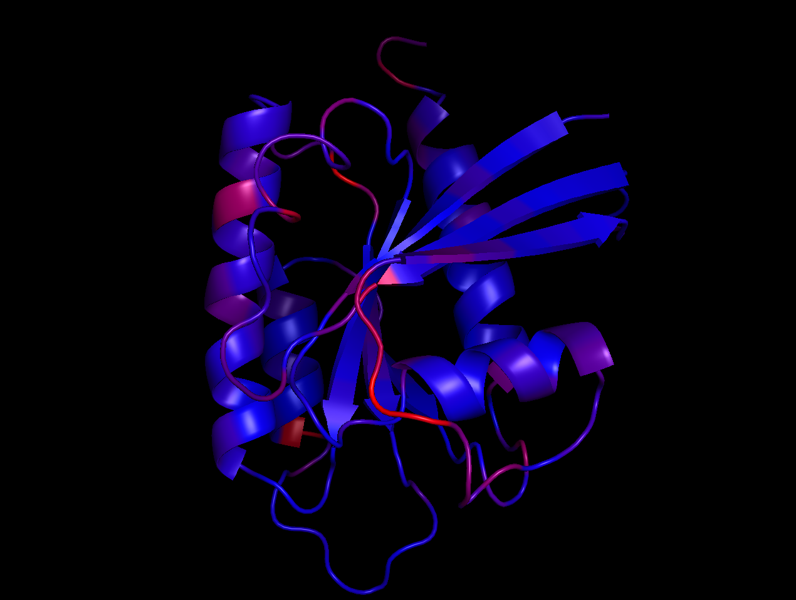

    
    

# Summer 2021 RosettaCommons Internship (Stanford Lab)

## Preparation

Prior to the bootcamp, we were assigned homework to set up PyRosetta and learn Python.

In [homework #1](preparation/01_00_How_to_Get_Started.ipynb), we install PyRosetta on our Google Colab Environments. It required some internal tweaking and a separate .whl from the developer. In its [continuation](01_02_PyRosetta_Google_Drive_Usage_Example.ipynb), we check if everything works.

We then do [homework #2](preparation/homework_2.py) on Python for-loops, [homework #3](preparation/homework_3.ipynb) on if-else statements, and [homework #4](preparation/homework_4.ipynb) on functions. 

 
Google Colab

    
To make everything work in Google Colab, I ended up having a PyRosetta directory with the .whl file in my Google Drive home directory MyDrive. Also, I kept the inputs, Media, and Sessions directories in a directory named temp_pyrbc_202103_notebooks.
    

## Bootcamp (June 7 - June 12) 

We spent the first week of our internship at the University of North Carolina at Chapel Hill, where we learned PyRosetta and other useful skills that will come handy during the rest of our internships.

During the week, we worked on PyRosetta that was set up in Google Colab. Our teacher was Andrew Leaver-Fay (amazing guy, knows everything about Rosetta and the field).

We had around 15 sessions, starting with:

       * `pose` class basics
       * PyMol visualizer
       * Rosetta score functions like `scorefxn()`

Getting into more advanced things:

	* Movers to mutate residues
	* Basic folding processes with algorithms like Centroid Folding
	* XML scripts

and many other things.

So we were able to build proteins like this:

I've really enjoyed the bootcamp because I got to learn about a very exciting field of protein design and prediction, and I also got to meet amazing people from all over the US! You can learn more about my experience on my [website](https://temir.dev/blog_posts/rosetta-week-1/rosetta-week-1).

## Research (June 13 - August 8)

## Presentation (August 9 - August 13)