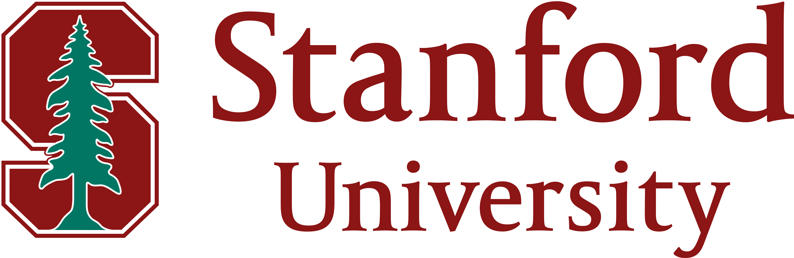

    
    

# Summer 2021 RosettaCommons Internship (Stanford Lab)

## Preparation

Prior to the bootcamp, we were assigned homework to set up PyRosetta and learn Python.

In [homework #1](01_00_How_to_Get_Started.ipynb), we install PyRosetta on our Google Colab Environments. It required some internal tweaking and a separate .whl from the developer. In its [continuation](01_02_PyRosetta_Google_Drive_Usage_Example.ipynb), we check if everything works.

We then did some homework on Python [for-loops](homework_2.py), separe [if-else](homework_3.ipynb) statements, and [functions](homework_4.py). 

## Bootcamp (June 7 - June 12) 

## Research (June 13 - August 8)

## Presentation (August 9 - August 13)